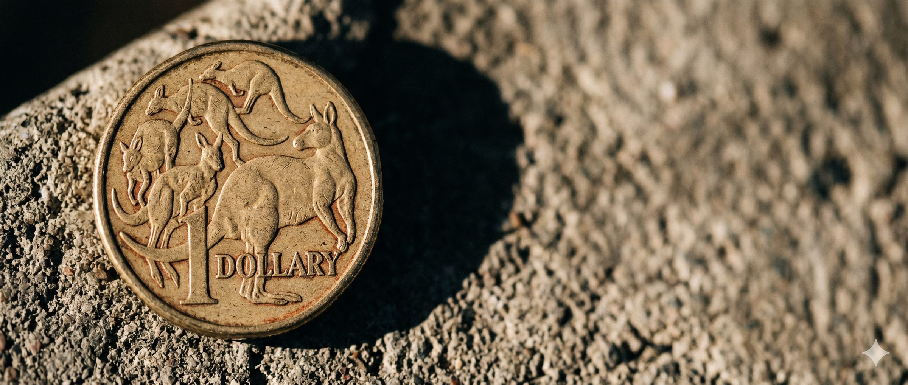

# Image prompts for the Independent Front website

Generate these in **Gemini 2.5 / Nano Banana Pro**. Save each as the indicated filename inside `site/images/`. The HTML/CSS already references those filenames in the optional image slots — if a file is missing, the page silently falls back to a typographic-only treatment, so you can roll out images one at a time.

## Anti-AI-slop guardrails (apply to every prompt)

Every prompt below ends with this fixed style block. Paste it on the end of any prompt you write yourself:

> **Style: documentary photography, restrained editorial, muted natural palette (warm cream, deep black, oxidised red ochre as the only saturated tone). Real-world materials and weathering. NOT illustrative, NOT 3D-rendered, NOT stylised, NOT AI-glossy. Avoid: people facing the camera, plastic skin, perfect symmetry, rainbow lighting, glowing edges, lens flares, "epic" cinematic look, oversaturated sunsets, multiple overlapping subjects, tech-bro hero shots. Reference: Magnum Photos archival look, late-afternoon light, slight grain, single subject, generous negative space.**

If an image comes back too "AI-y", regenerate with the explicit instruction: *"plainer, more documentary, less stylised, less saturated"*.

---

## Recommended images (priority order)

The site works without any of these. The list below is ordered by impact-per-image. Generate top-down, stop when you've had enough.

### 1. `gate-bg.jpg` — behind the FIX EVERYTHING button (optional)

**Filename:** `gate-bg.jpg`
**Aspect:** 16:9 landscape, 2400×1350 minimum
**Where it goes:** Sits beneath the gate, very low opacity, behind the red button. The gate currently uses a programmatic gradient — adding this image gives it texture without changing the layout.

> A textured, almost-abstract photograph of weathered Australian terrain — cracked red-ochre earth meeting deep shadow, late afternoon. Looking down at the ground from standing height. No people, no horizon, no sky. Minimal composition, monumental feel. Slightly grainy, like a print scan. The image will sit at 8% opacity behind a red graphic — so the colour palette must include warm red-ochre tones that sit comfortably under the brand red `#c8102e`. **[append the anti-slop block above]**

### 2. `hero-economic.jpg` — Part I landing hero (optional)

**Filename:** `hero-economic.jpg`
**Aspect:** 21:9 ultrawide, 2800×1200 minimum
**Where it goes:** Optional band above the Part I hub-cards.

> A close-up photograph of an Australian one-dollar coin on rough concrete, lit by hard side-light. Single subject, deep shadow, generous negative space to the right. Documentary, not stylised. The coin is the only sharp thing; the concrete texture out-of-focus toward the edges. Composition leaves space for a typographic overlay on the right two-thirds. **[append the anti-slop block]**

### 3. `hero-social.jpg` — Part II landing

> A photograph of an empty hospital corridor late at night, taken from low to the ground. Pale terrazzo floor, white-painted walls, one fluorescent fixture at the end. No staff visible. A single wheeled equipment trolley in the middle distance. Long perspective lines. The image conveys capacity and quiet readiness, not crisis. Documentary. **[append the anti-slop block]**

### 4. `hero-infrastructure.jpg` — Part III landing

> A photograph of a CANDU 6 reactor pressure vessel under construction, taken from below at a shallow angle. The vessel dominates the frame; one human figure in hi-vis safety gear stands at the base for scale, back to camera, no face visible. Industrial cathedral scale. Hard overhead lighting from a partly-built containment dome. Steel grey, concrete cream, a hint of rust. **[append the anti-slop block]**

### 5. `hero-sovereignty.jpg` — Part IV landing

> A photograph of the Australian coastline taken from a Royal Australian Navy patrol vessel's bridge — looking forward, cloudy mid-afternoon, no people in frame. The bow cuts through ocean. Australian flag visible at the bow, weathered and wind-frayed. Landscape, horizontal, calm authority. NOT epic, NOT cinematic — quiet, observational. **[append the anti-slop block]**

### 6. `hero-reforms.jpg` — Part V landing

> A wide photograph of an empty Australian Federation-era courtroom interior, low light, no people. Dark timber benches, a single brass desk lamp lit, the rest in shadow. The image conveys institution, weight, the burden of process. Documentary photographic style — like a Wim Wenders interior. **[append the anti-slop block]**

### 7. `og-default.jpg` — Open Graph share image (recommended)

**Aspect:** 1200×630 (Facebook/Twitter standard)
**Where it goes:** When anyone shares any page on the site to social media, this is the default preview card. Important.

> A monumental graphic design composition — NOT photography. Deep black background. Centered, in giant Archivo Black white type, the words "AUSTRALIA REBUILT." with "REBUILT" in oxidised red `#c8102e`. Beneath, in small letter-spaced caps: "THE INDEPENDENT FRONT — POLICY PLATFORM, MAY 2026". Letterpress feel, slight grain, high contrast. Looks like a 1930s civic poster.

If Nano Banana struggles with text, generate a version without text and we can overlay the typography in HTML/CSS.

### 8. `wordmark.svg` — proper logo (deferred — best done by hand)

The wordmark currently renders in CSS using Archivo Black. If you want a custom hand-set logo down the line, that's a graphic-design task, not an AI-image task. Until then, the CSS wordmark is the logo.

---

## How to wire an image into a page

Once you've generated `hero-economic.jpg`, drop it into `site/images/`. To use it on `economic-foundation.html`, add this snippet just below the `page-hero__bg` div:

```html

```

Alternatively, send me the image and I'll wire it in.

---

## What NOT to generate

- Stock-photo-style "diverse smiling people in office" shots. The Front is policy work, not a sales site.
- Australian flag photographs as decoration. The flag will read as campaign-y.
- Sunset over Uluru / Sydney Harbour cliché shots.
- Anything with a politician's face.
- Anything that depicts specific Indigenous communities or sacred sites without explicit consultation.
- Anything that depicts named individuals.

If in doubt: prefer typography. The site works without imagery; it would be diminished by the wrong imagery.

---

## File checklist

- [ ] `site/images/gate-bg.jpg`
- [ ] `site/images/hero-economic.jpg`
- [ ] `site/images/hero-social.jpg`
- [ ] `site/images/hero-infrastructure.jpg`
- [ ] `site/images/hero-sovereignty.jpg`
- [ ] `site/images/hero-reforms.jpg`
- [ ] `site/images/og-default.jpg`

When images are in place, ask for the wiring-up step and I'll modify the HTML to reference them.
